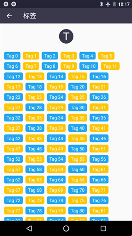
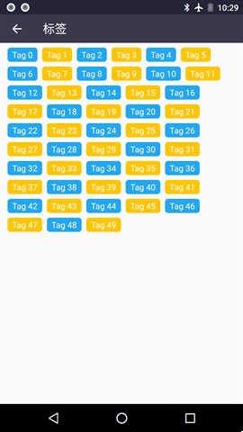

# TagLayoutManager

This is an awesome library for RecyclerView. I custom the LayoutManager for RecyclerView, make the child view flow layout, and other people can custom different RecyclerView.Adapter to display the beautiful UI.

## Demo

Demo 1:


Demo 2:



Demo 3:


Demo 4:




## Setup and usage

Support:recyclerview-v7:25+

```
If you don't want to update recyclerview to 25+, welcome to clone this 
project, then copy the taglayoutmanager-lib module to your own 
project, and change the configure for your project.
```

Add dependencies by adding the following lines to your app/build.gradle.

```GRADLE 
compile 'com.doitlite:TagLayoutManager:1.0.0'
```

when error happened as:

``` Error
Error:Could not find TagLayoutManager.jar (com.doitlite:TagLayoutManager:1.0.0).
Searched in the following locations:
    https://jcenter.bintray.com/com/doitlite/TagLayoutManager/1.0.0/TagLayoutManager-1.0.0.jar
```

Solution:

```GRADLE 
compile 'com.doitlite:TagLayoutManager:1.0.0:@aar'
```

set LayoutManager for RecyclerView

```JAVA
mRv.setLayoutManager(new TagLayoutManager.Builder()
                .setBorderLeft(Utils.dp2px(this, 12))
                .setBorderTop(Utils.dp2px(this, 8))
                .setBorderRight(Utils.dp2px(this, 12))
                .setBorderBottom(Utils.dp2px(this, 8))
                .setBorderHor(Utils.dp2px(this, 8))
                .setBorderVer(Utils.dp2px(this, 8))
                .create());
```

## License [  ](https://github.com/doitlite/TagLayoutManager/blob/master/LICENSE)

``` License
Copyright 2017 doitlite.
    
Licensed under the Apache License, Version 2.0 (the "License");
you may not use this file except in compliance with the License.
You may obtain a copy of the License at

   http://www.apache.org/licenses/LICENSE-2.0

Unless required by applicable law or agreed to in writing, software
distributed under the License is distributed on an "AS IS" BASIS,
WITHOUT WARRANTIES OR CONDITIONS OF ANY KIND, either express or implied.
See the License for the specific language governing permissions and
limitations under the License.
```